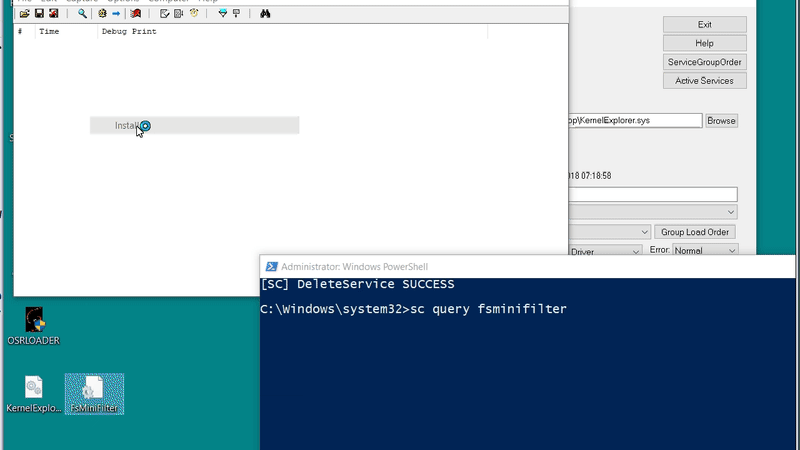

POC code to prevent the loading of a specific driver (kernelexplorer.sys) from kernel mode.
I use a file system minifilter in order to catch the mapping of executable code and set up 
the appropriate callback inorder to prevent (kerenlexplorer.sys) from loading, with no undocumented
trickery involved, just registering for a IRP_MJ_ACQUIRE_FOR_SECION_SYNCHRONIZATION  event.

Another, much more invasive method, is to set up a LoadImageNotifyRoutine callback and 
overwrite the DriverEntry routine to simply return an appropriate NTSTATUS error code 
(STATUS_ACCESS_DENIED, STATUS_UNSUCCESSFUL, etc).
	
	MOV RAX, 0xC0000022 ; STATUS_ACCESS_DEN14IED
	RET;
	
	

