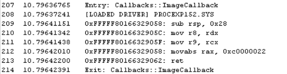

* FILE SYSTEM MINIFILTER

Poc code to prevent the loading of a specific driver (kernelexplorer.sys) from kernel mode.
I wrote a file system minifilter in order to catch the mapping of executable code and set up
the appropriate callback in order to prevent the driver image from loading, with no undocumented
trickery involved, just registering for an IRP_MJ_ACQUIRE_FOR_SECTION_SYNCHRONIZATION event.

* OVERWRITING DRIVER ENTRY CODE 

Another, much more invasive method, is to set up a LoadImageNotifyRoutine callback and overwrite the DriverEntry routine to simply return an appropriate NTSTATUS error code (STATUS_ACCESS_DENIED, STATUS_UNSUCCESSFUL, etc).

	
	MOV RAX, 0xC0000022 ; STATUS_ACCESS_DEN14IED
	RET;
	
	
	void 
	ImageNotifyCallback(
		PUNICODE_STRING ImageName, 
		HANDLE Pid, 
		PIMAGE_INFO ImageInfo) 
	{
	
		if (!pid) 
		{	
			UNICODE_STRING ProcessExplorer =
				RTL_CONSTANT_STRING(LR"(\Device\HarddiskVolume3\Windows\System32\drivers\PROCEXP152.SYS)");
			if (RtlCompareUnicodeString(&ProcessExplorer, ImageName, TRUE) == 0) 
			{
				auto dos = (PIMAGE_DOS_HEADER) ImageInfo->ImageBase;
				auto nt = (PIMAGE_NT_HEADERS)((PBYTE) ImageInfo->ImageBase + dos->e_lfanew);
				auto EntryPoint = (PBYTE)((ULONG_PTR) ImageInfo->ImageBase + nt->OptionalHeader.AddressOfEntryPoint);

				csh handle{};
				cs_insn* insn{};
				if (cs_open(CS_ARCH_X86, CS_MODE_64, &handle) == CS_ERR_OK) 
				{
					auto count = cs_disasm(handle, 
							       EntryPoint, 
							       11, 
							       (ULONG_PTR)EntryPoint, 
							       0, 
							       &insn);
					if (count) {
						for (auto i = 0ul; i < count; ++i)
							DbgPrint("0x%p: %s\t%s\n", insn[i].address, 
										insn[i].mnemonic, 
										insn[i].op_str);
						cs_free(insn, count);
						insn = nullptr;
					}	
					/*
						movabs	rax, 0xc0000022
						ret
					*/
					BYTE CONST sc[] { 0x48, 0xB8, 0x22, 0x00, 0x00, 0xC0, 0x00, 0x00, 0x00, 0x00, 0xC3 };
					
					for (auto i = 0ul; i < sizeof(sc); ++i) 
						*(EntryPoint + i) = *(sc + i);
					
					count = cs_disasm(handle, 
							  entry_point, 
							  11, 
							  (ULONG_PTR) EntryPoint, 
							  0, 
							  &insn);
														
					/* print it out just to see in debugger */
					if (count) {
						for (auto i = 0ul; i < count; ++i)
							DbgPrint("0x%p: %s\t%s\n", insn[i].address, 
										insn[i].mnemonic, 
										insn[i].op_str);
						cs_free(insn, count);
					}
					cs_close(&handle);
				}
			}
			else
				DbgPrint("[LOADED DRIVER] %S ", ImageName->Buffer);
		}			
	}
	

