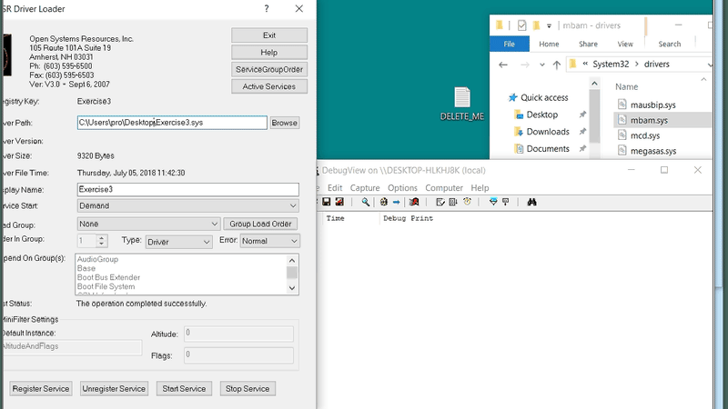

* SampleE (3rd question) *

Instead of deleting a file the documented way, the malware skips the native api
and creates an IRP from scratch that resembles the file deletion process.

DeleteFile (WinAPI) internally (eventually) calls ntdll!NtSetInformationFile with the
FILE_DISPOSITION_INFORMATION struct and its only (visible) memeber, DeleteFile,
set to true if its intention is to delete.   The rootkit here, in a sense, imitates what 
the I/O Manager would do, by creating an IRP from scratch to service the deletion request of a specific .sys file (mbam.sys) in the standard drivers directory where most drivers are stored.  It initializes a UNICODE_STRING of the full path to mbam.sys and gets a handle to it.  It uses the handle to get a pointer (the address) of the actual FILE_OBJ itself (ObReferenceObjectByHandle)  and uses the FILE_OBJECT and HANDLE value for the next subroutine that implements the actual deletion procedure.  It starts out my getting the underlying DEVICE_OBJ in which to send the IRP, created and properly filled out, to.  So, it turns "the mundane task" of "simply" deleting a file into some sick shit.

The ending request ends of the Params ends up looking like below: 
 
 nt!_IO_STACK_LOCATION
;    +0x004 Parameters          :
;       +0x000 SetFile             :
;          +0x000 Length              : 1 //also in usermode deletion is 1
;          +0x004 FileInformationClass : d ( FileDispositionInformation )
;          +0x008 FileObject          : 0x82212b30 _FILE_OBJECT  //FILE_OBJ of the FILE_HANDLE
;          +0x00c ReplaceIfExists     : 0x24 '$'
;          +0x00d AdvanceOnly         : 0x6 ''
;          +0x00c ClusterCount        : 0x624   
;          +0x00c DeleteHandle        : 0x00000624 Void //the handle value of the file to delete

